# lab6web
# bagus tri handono - 312010170
# 20.TI.B1
============================================================= 
membuat layout sederhana menggunakan framework agar lebih responsive 
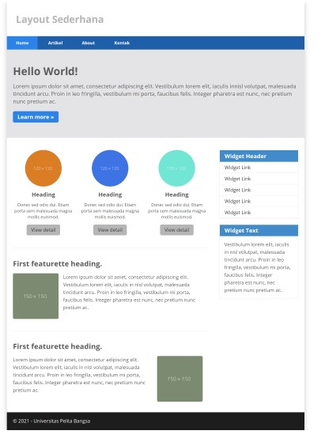 
link code secara keseluruhan 
link code=>[contoh](code/home.html) 

membuat layout sederhana pada HTML yang kita mulai membuat kerangkanya terlebih dahulu 
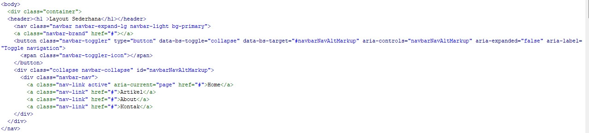 
jika sudah mari kita buka pada browser maka akan terlihat seperti gamabar dibawah ini 
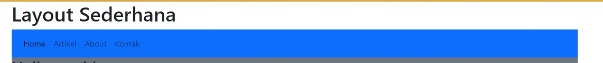 
setelah itu mari kita buat navigasi pada CSS 
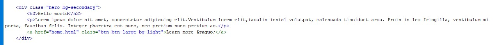 
jika sudah mari refresh browser maka akan tampak seperti dibawah ini 
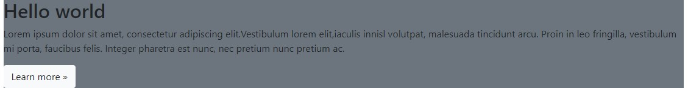 
membuat panel hero
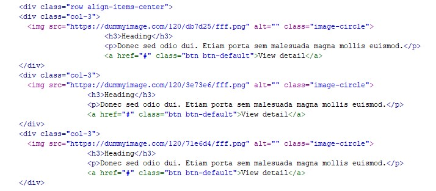 
jika sudah mari refresh browser maka akan tampak seperti dibawah ini 
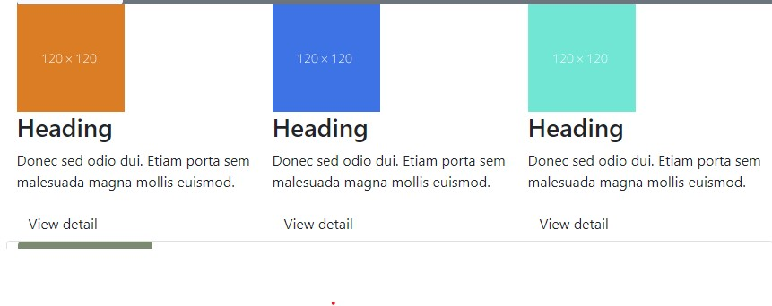 
membuat widget panel 
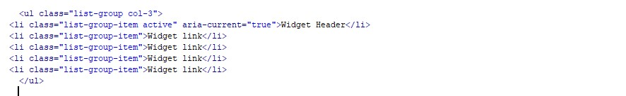 
jika sudah mari refresh browser maka akan tampak seperti dibawah ini 
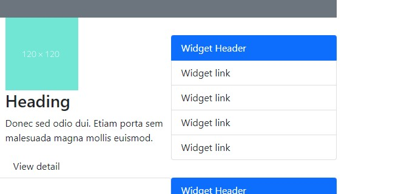 
membuat content panel 
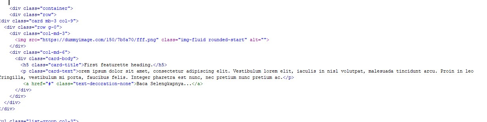 
jika sudah mari refresh browser maka akan tampak seperti dibawah ini 
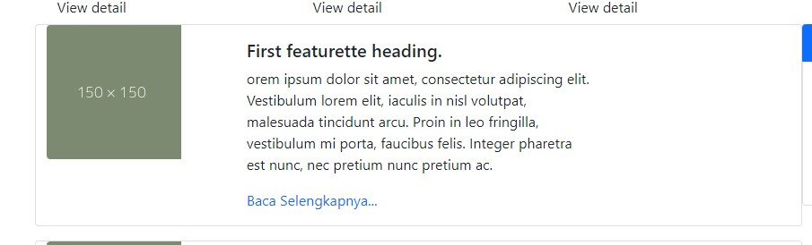 
membuat widget panel 
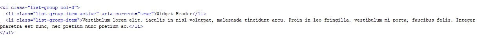 
jika sudah mari refresh browser maka akan tampak seperti dibawah ini 
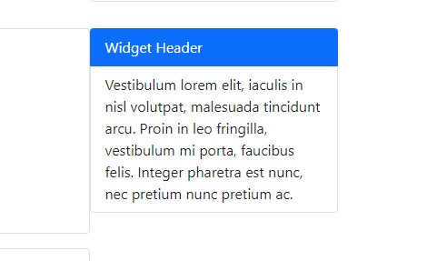 
membuat footer 
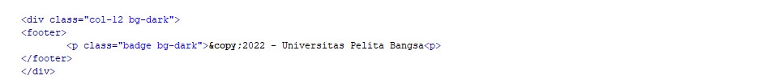 
jika sudah mari refresh browser maka akan tampak seperti dibawah ini 
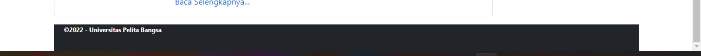 

terima kasih
